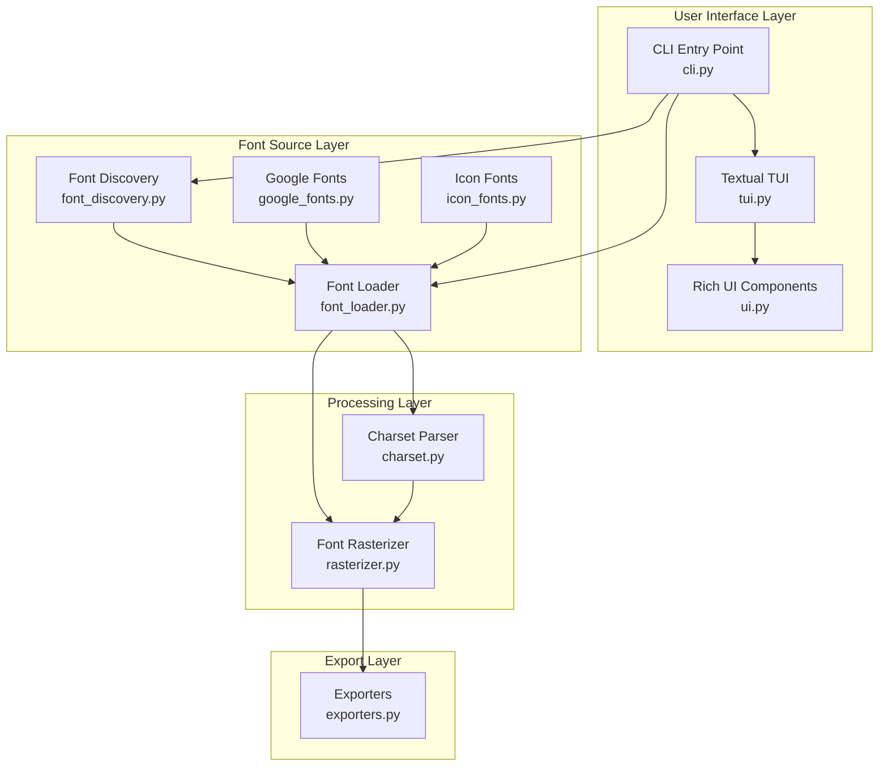

# Minifont Architecture

This document describes the internal architecture and design of Minifont.

## System Overview



## Module Architecture

### 1. User Interface Layer

#### cli.py
**Purpose**: Main entry point and command-line interface

**Key Components**:
- `main()`: CLI entry point with Click decorators
- `interactive_mode()`: Launches interactive TUI
- `process_font()`: Batch processing workflow
- `process_icon_font()`: Icon font processing workflow

**Flow**:
```
User Command → Argument Parsing → Mode Selection
    ├─ Interactive Mode → TUI
    ├─ Batch Mode → Direct Processing
    └─ List Mode → Display Information
```

#### tui.py
**Purpose**: Textual-based Terminal User Interface

**Key Components**:
- `MinifontTUI`: Main application class
- `FileBrowserPanel`: Directory and font browsing
- `ParametersPanel`: Font conversion parameters
- `PreviewPanel`: Character bitmap preview

**Features**:
- File system navigation
- Live parameter adjustment
- Real-time preview
- Keyboard shortcuts

#### ui.py
**Purpose**: Rich library UI components and formatting

**Key Functions**:
- `show_glyph_preview()`: Display character bitmaps
- `show_fonts_table()`: Formatted font listings
- `show_conversion_summary()`: Results summary
- `show_progress_spinner()`: Loading indicators

### 2. Font Source Layer

#### font_discovery.py
**Purpose**: Automatic font file discovery

**Algorithm**:
```python
def find_fonts_in_directory(directory, recursive=False):
    1. Scan directory for font files (.ttf, .otf, .woff, .woff2)
    2. Extract metadata using fontTools
    3. Group by font family
    4. Return structured FontInfo objects
```

**Data Structure**:
```python
@dataclass
class FontInfo:
    path: Path
    filename: str
    font_name: str
    format: str  # TTF, OTF, WOFF, WOFF2
    size_kb: float
```

#### font_loader.py
**Purpose**: Font file loading and validation

**Capabilities**:
- Font format detection
- Metadata extraction
- Character availability checking
- Font validation

**Key Methods**:
- `validate()`: Verify font file integrity
- `get_font_name()`: Extract font family name
- `get_available_characters()`: List supported characters

#### google_fonts.py
**Purpose**: Google Fonts API integration

**Workflow**:
```
1. Query Google Fonts API for font metadata
2. Download font file from CDN
3. Save to temporary/cache directory
4. Return path for processing
```

**Features**:
- Popular font presets
- Variant selection (regular, bold, italic)
- Automatic caching
- Error handling

#### icon_fonts.py
**Purpose**: Icon font support and mapping

**Icon Registries**:
- Material Icons: Unicode mappings
- Font Awesome: Unicode mappings
- Preset collections (navigation, actions, media, etc.)

**Structure**:
```python
class IconFont:
    name: str
    unicode_map: Dict[str, int]

    def get_icon_code(self, icon_name: str) -> int:
        # Return Unicode code point for icon
```

### 3. Processing Layer

#### charset.py
**Purpose**: Character set parsing and management

**Parser Algorithm**:
```python
def parse_range(range_str: str) -> set[int]:
    "32-126,160-255" →
    1. Split by comma
    2. For each segment:
        - If contains '-': parse as range
        - Else: parse as single character
    3. Union all sets
    4. Return deduplicated character codes
```

**Presets**:
- `ascii`: 32-126 (printable ASCII)
- `extended`: 32-255 (extended ASCII)
- `digits`: 48-57 (0-9)
- `uppercase`: 65-90 (A-Z)
- `lowercase`: 97-122 (a-z)

#### rasterizer.py
**Purpose**: Font rasterization using FreeType

**Core Algorithm**:
```python
def rasterize_glyph(char_code: int) -> GlyphBitmap:
    1. Load character using FreeType
    2. Render to 1-bit monochrome bitmap
    3. Calculate pitch (bytes per row)
    4. Extract metrics (width, height, advance, offset)
    5. Convert to packed byte array
    6. Return GlyphBitmap object
```

**Bitmap Format**:
```
Width: 8 pixels
Height: 12 pixels
Pitch: 1 byte per row

Bitmap representation:
Row 0: [byte 0] = 0b11111111 → ████████
Row 1: [byte 1] = 0b10000001 → █······█
Row 2: [byte 2] = 0b10000001 → █······█
...
Row 11: [byte 11] = 0b00000000 → ········

Total bytes: height × pitch = 12 × 1 = 12 bytes
```

**Data Structure**:
```python
@dataclass
class GlyphBitmap:
    char_code: int          # Unicode code point
    width: int              # Bitmap width in pixels
    height: int             # Bitmap height in pixels
    advance_x: int          # Horizontal advance
    offset_x: int           # X offset from cursor
    offset_y: int           # Y offset from baseline
    bitmap: bytes           # Packed bitmap data
    pitch: int              # Bytes per row (includes padding)
```

### 4. Export Layer

#### exporters.py
**Purpose**: Multiple output format generation

**Exporter Classes**:

1. **CHeaderExporter**
   - Format: C header file
   - Target: Adafruit GFX library
   - Structure:
     ```c
     const uint8_t FontBitmaps[] PROGMEM = { ... };
     const GFXglyph FontGlyphs[] PROGMEM = { ... };
     ```

2. **XBMExporter**
   - Format: X BitMap
   - Target: U8g2 library
   - Structure:
     ```c
     #define font_width 128
     #define font_height 16
     static unsigned char font_bits[] = { ... };
     ```

3. **BDFExporter**
   - Format: Bitmap Distribution Format
   - Target: X11, legacy systems
   - Structure:
     ```
     STARTFONT 2.1
     FONT FontName
     SIZE 16 75 75
     ...
     ```

4. **PythonExporter**
   - Format: Python byte arrays
   - Target: MicroPython
   - Structure:
     ```python
     Font_bitmaps = bytes([...])
     Font_glyphs = [(...), ...]
     ```

## Data Flow

### Complete Conversion Pipeline

```
┌─────────────┐
│ Font Source │
│ (TTF/OTF/   │
│  Google/    │
│  Icon)      │
└──────┬──────┘
       │
       ↓
┌──────────────┐
│ Font Loader  │
│ - Validate   │
│ - Metadata   │
└──────┬───────┘
       │
       ↓
┌──────────────┐
│ Charset      │
│ Parser       │
│ - Presets    │
│ - Ranges     │
└──────┬───────┘
       │
       ↓
┌──────────────┐
│ Rasterizer   │
│ - FreeType   │
│ - 1-bit      │
│ - Metrics    │
└──────┬───────┘
       │
       ↓
┌──────────────┐
│ Exporter     │
│ - Format     │
│ - Write      │
└──────┬───────┘
       │
       ↓
┌──────────────┐
│ Output File  │
│ (.h/.xbm/    │
│  .bdf/.py)   │
└──────────────┘
```

## Key Design Decisions

### 1. Pitch-Aware Bitmap Handling

**Problem**: FreeType may add padding to bitmap rows for alignment.

**Solution**: Store `pitch` (actual bytes per row) in `GlyphBitmap` and use it for all bitmap traversal:

```python
# Reading bitmap with pitch
for y in range(height):
    row_offset = y * pitch
    for x in range(width):
        byte_pos = row_offset + (x // 8)
        bit_pos = 7 - (x % 8)
        bit_value = (bitmap[byte_pos] >> bit_pos) & 1
```

### 2. Modular Exporter Architecture

Each exporter inherits from `BaseExporter` and implements `export()`:

```python
class BaseExporter:
    def export(self, glyphs: List[GlyphBitmap], output_path: str):
        raise NotImplementedError
```

Benefits:
- Easy to add new formats
- Consistent interface
- Shared utilities (name sanitization)

### 3. Rich Terminal UI

Uses Rich library for enhanced terminal output:
- Syntax highlighting
- Tables and panels
- Progress indicators
- Color and styling

### 4. Textual TUI

Uses Textual framework for full TUI:
- Reactive components
- Event-driven architecture
- CSS-like styling
- Keyboard navigation

## Performance Considerations

### Font Loading
- Lazy loading: fonts loaded only when selected
- Caching: Google Fonts cached locally
- Validation: early error detection

### Rasterization
- FreeType optimization: native C library
- Batch processing: all characters in one pass
- Memory efficient: streaming to output

### UI Rendering
- Incremental updates: only changed components
- Truncation: long lists limited to first N items
- Async operations: non-blocking UI

## Testing Strategy

### Unit Tests
- `test_charset.py`: Character set parsing
- `test_exporters.py`: Export format generation
- Coverage: Core functionality

### Integration Tests
- Font loading workflows
- End-to-end conversion
- Format validation

### Manual Testing
- Interactive mode
- Various font types
- Edge cases (empty glyphs, wide characters)

## Error Handling

### Font Loading Errors
```python
try:
    loader = FontLoader(font_path)
    loader.validate()
except FontLoaderError as e:
    ui.show_error(f"Font loading failed: {e}")
    sys.exit(1)
```

### Character Set Errors
```python
try:
    char_codes = Charset.parse_range(charset_input)
except CharsetError as e:
    ui.show_error(f"Invalid charset: {e}")
    sys.exit(1)
```

### Graceful Degradation
- Missing characters: warn but continue
- Partial font support: use available glyphs
- Invalid formats: clear error messages

## Dependencies

### Core Dependencies
- **fontTools**: Font metadata extraction
- **freetype-py**: Font rasterization
- **Pillow**: Image processing (future PNG export)
- **click**: CLI framework
- **requests**: HTTP for Google Fonts

### UI Dependencies
- **rich**: Terminal formatting and tables
- **questionary**: Interactive prompts
- **textual**: Full TUI framework

## Future Architecture Enhancements

### Planned Improvements
1. **Plugin System**: Custom exporters
2. **Font Caching**: Persistent font database
3. **Parallel Processing**: Multi-threaded rasterization
4. **Preview Server**: Web-based preview
5. **Configuration Files**: Save/load settings

### Extensibility Points
- Add new exporters by subclassing `BaseExporter`
- Add new icon fonts by extending `IconFontRegistry`
- Add new charsets by updating `Charset.PRESETS`
- Add new UI themes via Textual CSS
